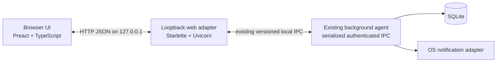

# Local web GUI proposal

**Status:** Approved for requirements and implementation
**Scope:** Approved planning record. Authoritative behavior lives in the top-level
requirements, architecture, and local-web-GUI feature requirement.

## Approved decision

Add a new, optional local web interface with feature parity to the approved
August 12, 2026 baseline, while retaining the TUI and the existing background
agent. The maintainer approved this decision, the authoritative changes, the
feature requirement, implementation, and local commits on August 12, 2026.

This is an intentional product-boundary change: before this proposal was
approved, the top-level requirements explicitly excluded GUI and web interfaces,
and the architecture said a network service was unnecessary. The maintainer's
approval authorized the corresponding changes to both authoritative documents.

The recommended stack is:

- **Python web adapter:** Starlette served by Uvicorn, bound to loopback only.
- **Browser client:** TypeScript and Preact, built by Vite into static assets that
  are packaged with the Python application.
- **Agent integration:** the web adapter is the single foreground IPC client and
  uses the existing authenticated, versioned agent protocol. The browser never
  accesses SQLite or the agent IPC endpoint directly.
- **Updates:** JSON HTTP endpoints plus modest polling for authoritative state;
  elapsed time is rendered from the persisted start timestamp in the browser.
  WebSockets are not needed for the first release.

This balances a small installed footprint with a component model suitable for
four substantial workflows. Node.js and `node_modules` are development/build
dependencies only; a packaged release contains the compiled HTML, CSS, and
JavaScript, not a Node runtime.

## Recorded design decisions

The maintainer selected the following direction during proposal review on
August 12, 2026:

1. Version 1 is same-machine only and has no LAN access.
2. The TUI remains the default interface; the web GUI is explicitly launched.
3. Version 1 rejects simultaneous TUI and web foreground clients.
4. Browser-local `System`, `Light`, and `Dark` appearance choices are sufficient;
   no shared cross-interface palette or configuration migration is required.
5. Web launch opens the default browser automatically. A `--no-open` option
   supports headless or manually opened sessions.
6. Starlette/Uvicorn with Preact/TypeScript is accepted as the proposed stack,
   subject to the planned packaging and footprint validation gates.

These decisions resolve the proposal's open design questions. The maintainer
subsequently authorized the plan, documentation changes, implementation, and
local commits on August 12, 2026. Nothing is pushed before maintainer review.

## Goals

- Provide Track, Review, Manage, and Settings workflows with the same durable
  outcomes, validation, recovery, and error semantics as the TUI.
- Work responsively from 320 px phone-sized viewports through desktop browsers.
- Preserve local-first and offline operation, with no account, CDN, telemetry,
  or internet dependency at runtime.
- Preserve keyboard-only use and add pointer/touch-friendly controls.
- Keep the background agent as the only database writer and owner of reminders.
- Keep the web layer thin: translate HTTP payloads to existing application/IPC
  operations and shape presentation data, without reimplementing business rules.
- Package the GUI with the existing native artifacts on Linux, Windows, and
  macOS.

## Non-goals for the first release

- LAN or remote access, TLS termination, accounts, or multi-user operation.
- Replacing or removing the TUI.
- Cloud synchronization, public APIs, integrations, or telemetry.
- A PWA/service worker, offline browser cache, system tray, or mobile app.
- Simultaneous TUI and web agent-protocol clients. The current IPC protocol does
  not guarantee concurrent clients; launchers must report a clear conflict
  instead of racing them. Multiple tabs share one web protocol client.
- New tracking behavior beyond what is already approved for the TUI.

## Parity definition

Feature parity means that every workflow and durable result approved in the
August 12, 2026 feature-requirement index is available in the web interface. It
does not mean copying terminal layout or browser-hostile function-key bindings.

| Area | Web behavior required for parity |
| --- | --- |
| Persistent shell | Active project, activity, local start, note, live elapsed time, reminder prompt, and success/error status remain visible across views. |
| Track | Five-item recent-work deck; deliberate selection and confirmation; separate quick-switch and manual notes; classified Start/Switch/Restart/no-op action; Stop; active-detail edit; today's completed total. |
| Review | Shared date/project/activity filters; completed, daily, and range representations; day grouping and midnight splits; row selection; correction; missed entry; confirmed deletion; matching CSV export and overwrite confirmation. |
| Manage | Hierarchical active and archived projects/activities; exact-target archive confirmation; restore rules; explicit project and activity creation. |
| Settings | Reminder enables and intervals; weekly window; snooze duration; idle-triggered reminder preference and availability; delimiter; persistent appearance; configuration path. |
| Recovery | Reconnecting restores the active timer and canonical values without inventing a stop time or resetting reminders. |
| Accessibility | Complete native tab order, Enter/Space activation, visible focus, labels and error associations, reduced-motion support, and screen-reader status announcements. |
| Keyboard efficiency | `1`–`5` selects recent work when focus is outside an editor; all actions remain reachable by Tab and Enter; a visible shortcut dialog documents web-safe shortcuts. Browser/OS-reserved F-keys are not intercepted. |

The web appearance preference may be browser-local (`System`, `Light`, or
`Dark`) in the first release. The existing Textual palette remains unchanged.
If maintainers instead want one cross-interface palette registry, that should be
approved as a separate configuration and migration decision.

## Proposed user experience

### Responsive shell

- **Desktop (960 px and wider):** application header, persistent active-timer
  strip, top navigation, and view content up to a readable maximum width. Track
  uses two columns; Manage uses paired active/archived panels; Settings uses a
  two-column form where related values fit.
- **Tablet (720–959 px):** the same navigation and tables, with panels stacking
  as space requires.
- **Mobile (320–719 px):** compact active summary, bottom navigation, one-column
  forms, full-width actions, Review entry cards instead of a wide table, and
  edit/confirmation dialogs presented as full-width sheets.
- Layout changes never clear form data, selection, pending confirmation, or
  filters. Pointer targets are at least 44 px in touch layouts.

### View notes

- **Track:** recent work is the fastest path. Selecting a recent pair reveals the
  classified action and its independent note. Manual capture stays beside it on
  desktop and below it on narrow screens. Stop and Edit active belong to the
  persistent timer strip.
- **Review:** filters and representation are stable while navigating. Editing,
  adding, and deleting use focused dialogs rather than keeping a large editor
  permanently under the history table. Export remains an explicit server-side
  file path operation so overwrite rules match the TUI.
- **Manage:** active and archived trees preserve project/activity hierarchy.
  Archive and restore confirmations name the exact target and repeat that
  archiving does not stop an active timer.
- **Settings:** related reminder values are grouped, idle availability is
  explicit, and appearance is clearly labeled as browser-specific if that first
  release option is accepted.

## Architecture



Add `src/time_tracker/web/` as an interface adapter parallel to
`src/time_tracker/tui/`. It owns HTTP schemas, response shaping, static-asset
serving, and lifecycle. It may call shared application reporting projections,
but it does not access SQLite or implement timer, overlap, archive, reminder, or
configuration rules.

The web process owns one existing IPC client. A single async lock serializes all
IPC calls, and blocking `multiprocessing.connection` operations run off the ASGI
event loop. Multiple tabs may use the web server, but their requests still pass
through that one serialized client. Mutations return the committed canonical
result before the UI reports success.

### HTTP surface

Use a small, explicit JSON API rather than mirroring every agent method
one-for-one:

- `GET /api/bootstrap` — shell state, active timer, reminder, recent work,
  supported settings, idle status, and initial view data.
- `GET /api/state` — pollable active timer, reminder, today's total, and a state
  revision. The browser derives elapsed seconds between polls.
- `POST /api/timer/classify`, `POST /api/timer/start`,
  `POST /api/timer/stop`, and `PATCH /api/timer/active`.
- `GET /api/review` and `POST /api/review/export` with one typed filter and one
  selected representation.
- `POST /api/entries`, `PATCH /api/entries/{id}`, and
  `DELETE /api/entries/{id}`.
- `GET /api/manage`, `POST /api/manage/archive`,
  `POST /api/manage/restore`, `POST /api/projects`, and
  `POST /api/activities`.
- `GET /api/settings` and `PUT /api/settings` for agent-owned durable settings.
- `POST /api/reminders/confirm` and `POST /api/reminders/snooze`.

Responses use one envelope with either `data` or a structured error containing a
stable code, user-safe message, and optional field name. Browser code does not
parse exception strings to decide behavior. The existing agent protocol does not
need a version bump unless implementation discovers a genuinely missing agent
capability.

### State and refresh behavior

- Fetch bootstrap once, then poll `/api/state` every two seconds while visible
  and immediately on visibility/focus regain. Pause polling in a hidden tab.
- Render elapsed time every second from the server-provided aware start instant;
  replace it with authoritative state on every poll and mutation response.
- Refresh only the affected data set after a mutation: Track/recent/today after a
  transition, Review after entry writes, Manage after hierarchy writes, and
  Settings after saves.
- If the agent is unavailable, keep the last rendered read-only state, mark the
  connection as unavailable, disable mutations, and retry with bounded backoff.
  Never claim a timer transition succeeded without the committed response.

## Local server security

Loopback is still a network boundary. The first release must:

- bind only to `127.0.0.1` on stable port `47831` or an explicitly selected port;
- reject unexpected `Host` values to mitigate DNS rebinding;
- serve no CORS headers and require an exact same-origin `Origin` for mutations;
- generate a fresh 256-bit in-memory launch token, embed it in uncached
  same-origin HTML, and require it as `X-Time-Tracker-Token` on every mutation;
- accept mutations only as JSON with size limits and never mutate on `GET`;
- use a strict Content Security Policy (`default-src 'self'`), deny framing,
  set `Cross-Origin-Resource-Policy: same-origin`, disable MIME sniffing, and
  avoid third-party runtime assets;
- avoid putting the launch token, project names, notes, or entry data in URLs or
  logs; and
- keep LAN binding out of configuration. Remote access requires a separate
  threat model, authentication, and TLS design.

## Repository and packaging shape

```text
src/time_tracker/web/
  app.py              # ASGI factory, routes, middleware, lifecycle
  gateway.py          # serialized IPC adapter and response shaping
  schemas.py          # typed request/response validation
  security.py         # Host, Origin, token, headers, and limits
  static/             # committed production build consumed by PyInstaller

web/
  package.json
  package-lock.json
  vite.config.ts
  src/                # Preact components, API client, CSS, tests

tests/
  unit/web/
  integration/test_web_api.py
  e2e/test_web_gui.py
```

The production frontend build must be deterministic and checked for drift. The
Python wheel and PyInstaller artifacts include only `src/time_tracker/web/static`.
Add canonical `make web-build`, `make test-web`, and web-development targets
without replacing the existing `uv` commands for Python checks. CI installs Node
only for frontend lint/type/test/build jobs; packaged runtime artifacts do not
ship Node.js.

## Implementation sequence

### Gate 0 — approve boundaries and requirements

1. Review this proposal and mockups. **Complete.**
2. Record the selected design decisions in this proposal. **Complete.**
3. Update `docs/top-level-requirements.md` to remove the local GUI/web exclusion
   and make the loopback web interface an allowed product interface while
   preserving local-first, single-user, and keyboard-first rules. **Complete.**
4. Update `docs/architecture.md` to add the loopback HTTP adapter, chosen stack,
   security boundary, web code boundary, packaging, and web testing. **Complete.**
5. Create `docs/feature-requirements/local-web-gui.md`, index it only after
   maintainer approval, and mark it `Approved` before application code starts.
   **Complete.**

### Slice 1 — server skeleton and secure shell

- Add dependencies, CLI lifecycle, loopback binding, security middleware,
  static-asset packaging, health/bootstrap endpoints, and connection errors.
- Add `time-tracker --web` plus `--no-open` and optional `--port`, using stable
  default port `47831`.
  Preserve the current default TUI command.
- Prove source and frozen launches on one platform before feature screens.

### Slice 2 — Track parity

- Implement persistent shell, active recovery, elapsed rendering, recent deck,
  classified actions, manual capture, Stop, Edit active, reminders, snooze, and
  today's total.
- This slice proves committed-before-success behavior through Browser → HTTP →
  IPC → agent → SQLite and back.

### Slice 3 — Review parity

- Add shared filters and three representations, responsive table/cards,
  correction, missed entry, confirmed deletion, and filtered export with
  overwrite confirmation.
- Keep all date splitting, clipping, summaries, and overlap rules in existing
  Python application projections/use cases.

### Slice 4 — Manage and Settings parity

- Add hierarchical archive/restore/create flows and exact confirmations.
- Add reminder/window/snooze/idle/delimiter settings and browser appearance.

### Slice 5 — accessibility, packaging, and platform validation

- Complete keyboard and screen-reader review at 320, 720, and 1280 px; test light
  and dark appearance, 200% zoom, and reduced motion.
- Extend PyInstaller data collection and packaged smoke to launch the server,
  load the browser shell, start a timer, stop the browser/server while leaving
  the agent and timer running, relaunch, recover, stop, and shut down the agent.
- Validate Linux, Windows, and macOS packaging plus interactive WSL use; record
  only completed platform results in README Status.

## Test strategy and release gates

- **Frontend unit/component:** input normalization handoff, local view state,
  responsive representation selection, keyboard handling, dialogs, errors, and
  accessibility assertions.
- **Python unit:** schemas, error mapping, serialization lock, security headers,
  Host/Origin/token enforcement, size limits, and static resource resolution in
  source and frozen modes.
- **HTTP/IPC integration:** every endpoint against an isolated real agent and
  SQLite database, including atomic failures, reconnect, export overwrite, and
  settings reload.
- **Browser E2E:** critical parity paths at desktop and mobile viewports using a
  real local server; no mocked business behavior for release-gating paths.
- **Regression:** retain all TUI tests. Finish each slice with the existing full
  Python check set plus frontend lint, typecheck, unit tests, and production build.
- **Security:** automated rejection tests for non-loopback bind attempts,
  unexpected Host, cross-origin mutations, missing/incorrect token, non-JSON or
  oversized bodies, framing, and sensitive URL/log data.

Release is blocked until the packaged browser lifecycle passes on all three
native operating systems and the README records any remaining interactive
validation gaps.

## Risks and mitigations

| Risk | Mitigation |
| --- | --- |
| Two interface clients contend for a single-client IPC protocol | The web server owns one IPC connection; reject concurrent TUI/web launch in v1 and document the limitation. |
| Browser presentation duplicates business rules | Return classified actions and reporting projections from Python; TypeScript renders them and performs only immediate field validation. |
| Localhost attacks or accidental LAN exposure | Loopback-only binding, strict Host and Origin checks, per-launch mutation token, no CORS, CSP, and security regression tests. |
| Frontend toolchain increases contributor and release complexity | Preact with no component library, locked npm dependencies, committed production assets, deterministic build check, and no Node runtime in packages. |
| PyInstaller misses static assets or ASGI dependencies | Add frozen-resource tests and packaged lifecycle coverage early in Slice 1. |
| Polling causes redundant IPC load | Poll only small state, pause hidden tabs, serialize calls, and derive elapsed time locally; evaluate server-side fan-out only with measured need. |
| Browser shortcuts conflict with the host | Native controls and tab order are authoritative; avoid F-keys and document only tested, web-safe accelerators. |

## Technical references

- [Starlette](https://www.starlette.io/) is a typed, lightweight ASGI toolkit
  with static-file serving, lifespan hooks, and an HTTP/WebSocket test client.
- [Uvicorn settings](https://www.uvicorn.org/settings/) support programmatic
  loopback binding and explicit port selection.
- [Preact](https://preactjs.com/) provides a React-like component API with a
  small browser runtime and TypeScript types.
- [Vite backend integration](https://vite.dev/guide/backend-integration.html)
  documents building static frontend assets for a separate backend.
- The [OWASP CSRF guidance](https://cheatsheetseries.owasp.org/cheatsheets/Cross-Site_Request_Forgery_Prevention_Cheat_Sheet.html)
  recommends custom headers and origin verification for state-changing browser
  requests, and the [WebSocket guidance](https://cheatsheetseries.owasp.org/cheatsheets/WebSocket_Security_Cheat_Sheet.html)
  reinforces exact Origin validation if a later release adds sockets.

## Approval record

Design decisions were recorded on August 12, 2026. The maintainer approved the
proposal and authorized Gate 0 documentation, implementation, and local commits
on the same date. The branch and commits remain local until a later maintainer
approval to push.
